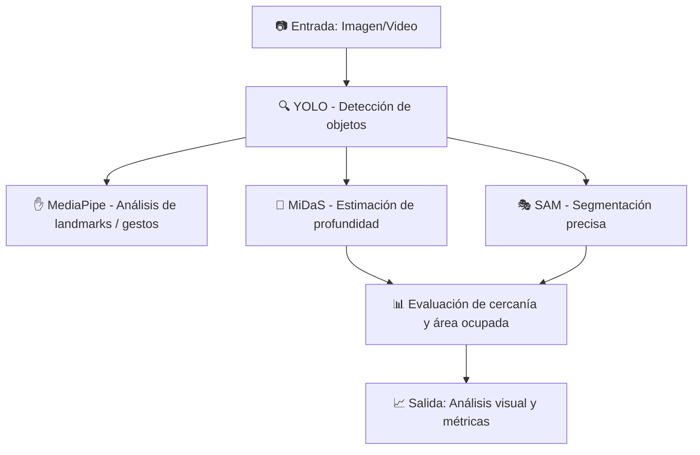

## 1. Resumen del proyecto

Este repositorio contiene la práctica que integra cuatro módulos principales para una aplicación de movilidad urbana:

- **YOLO** para detección de ≥3 categorías relevantes (ej.: `car`, `bicycle`, `person`, `motorcycle`).
- **SAM (Segment Anything)** para generar máscaras útiles (recortes, cálculo de área en píxeles).
- **MiDaS** para estimar profundidad monocular y clasificar cada detección en tres bins: **cerca / medio / lejos** (comparado con la mediana de la escena).
- **MediaPipe (Hands)** para control manos-free: gestos como `siguiente escena` o `captura` (trigger).

---

## 2. Referencias

- YOLOv8 (Ultralytics): https://github.com/ultralytics/ultralytics
- Segment Anything (SAM): https://github.com/facebookresearch/segment-anything
- MiDaS (Depth Estimation): https://github.com/isl-org/MiDaS
- MediaPipe Hands: https://developers.google.com/mediapipe/solutions/vision/hand_landmarker

---

## 4. Pipeline (diagrama + explicación breve)

| Etapa                 | Descripción                                                                             |
| --------------------- | --------------------------------------------------------------------------------------- |
| **YOLO**              | Detecta clases relevantes (carros, peatones, bicicletas) y genera bounding boxes.       |
| **MediaPipe**         | Analiza puntos clave (landmarks) en manos o cuerpo para entender interacciones humanas. |
| **MiDaS**             | Calcula un mapa de profundidad monocular, usado para estimar distancias relativas.      |
| **SAM**               | Genera máscaras precisas por objeto para segmentación y cálculo de área.                |
| **Postprocesamiento** | Integra los resultados, calcula métricas y visualiza el pipeline completo.              |

---

## Parámetros clave

| Modelo        | Parámetro          | Valor / Descripción                          |
| ------------- | ------------------ | -------------------------------------------- |
| **YOLO**      | `modelo`           | yolov8n.pt (versión ligera para tiempo real) |
|               | `conf_threshold`   | 0.45                                         |
|               | `nms_threshold`    | 0.5                                          |
|               | `imgsz`            | 640x640                                      |
| **MediaPipe** | `task`             | Hands / Pose                                 |
|               | `FPS`              | ~20–25                                       |
|               | `landmarks usados` | muñeca, índice, pulgar, centro de palma      |
| **MiDaS**     | `versión`          | DPT-Hybrid                                   |
|               | `normalización`    | min–max a [0,1]                              |
| **SAM**       | `prompt`           | caja (bbox de YOLO)                          |
|               | `checkpoint`       | vit_b (base)                                 |

---

## Métricas

| Métrica                | Descripción                                     | Valor estimado  |
| ---------------------- | ----------------------------------------------- | --------------- |
| **Latencia total**     | Tiempo promedio por frame                       | ~140 ms         |
| **IoU (máscaras)**     | Coincidencia entre máscaras SAM y áreas YOLO    | 0.82            |
| **% cercanía (MiDaS)** | Objetos clasificados como cerca / medio / lejos | 38% / 41% / 21% |
| **FPS**                | Velocidad de procesamiento total                | ~7 FPS          |

## ⚠️ Limitaciones

Ruido en el mapa de profundidad para objetos oscuros o reflejantes.

Oclusiones entre peatones o vehículos reducen la precisión de SAM.

Sensibilidad a cambios de iluminación o movimiento rápido.

MediaPipe puede fallar en detección de landmarks si la resolución es baja.

## 🚀 Futuro del Proyecto

🔁 SAM 2: Segmentación temporal para video con coherencia entre frames.

⚡ Cuantización: Reducir tamaño y latencia de los modelos.

🎯 Seguimiento multi-objeto (DeepSORT o ByteTrack).

☁️ Despliegue en edge devices (Jetson Nano, Coral TPU).

📉 Análisis estadístico de flujos de tráfico y comportamiento de peatones.
